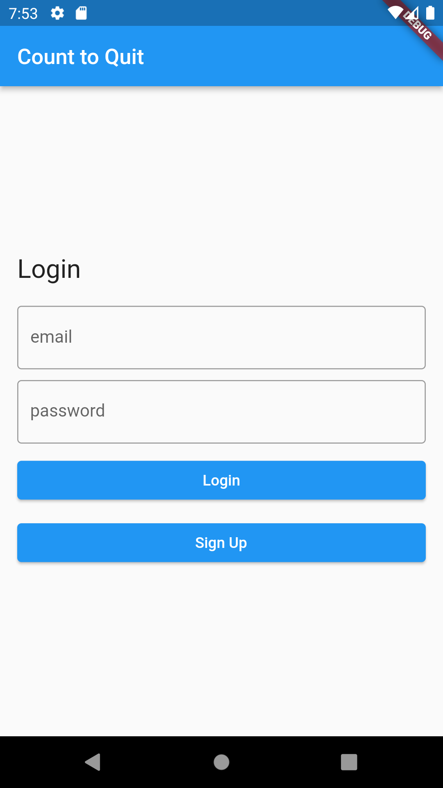
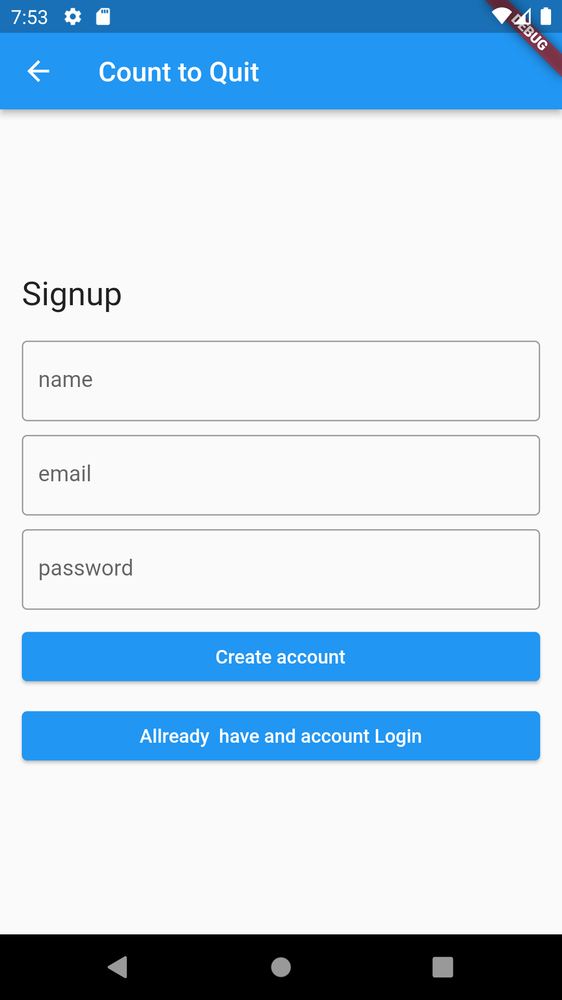
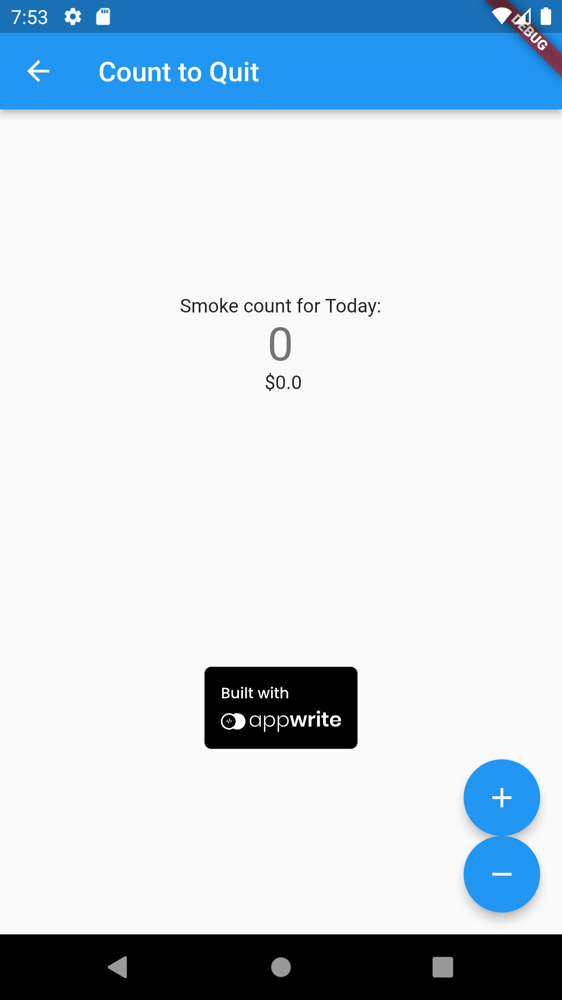

## This Is my first flutter app with Appwite
An app demo to help you quit smoking. 
It is a simple app demo built with Appwrite for Hacktoberfest 2021.

You count your cigarettes per day, and the cost and is saved in an appwrite document. This can be a rewarding way to cut down on your cigarette consumption with the goal of quitting.
As of right now the cost is based on the cost per carton in BC, Canada. A future feature - the user could add the brand and prices in their area.

A lot of this project is Frankensteined from the tutorials [React Bits (Damodar Lohani)](https://www.youtube.com/c/ReactBits) YouTube page - an amazing help. If you're looking to 
learn Flutter and Appwrite it's a top resource on both subjects.

### Login page logins into a user profile in the appwrite backend

### Signup page create's a user profile in the appwrite backend

### Home page were you can add or reduce the smoke count that is updated on the appwrite database

### Home page updated with the updated appwrite database

I also wrote a blog about my experience 
[What I learned by creating a Appwrite + Flutter demo](https://dev.to/jonathanvanhaaften/what-i-learned-by-creating-a-appwrite-flutter-demo-51ce)
